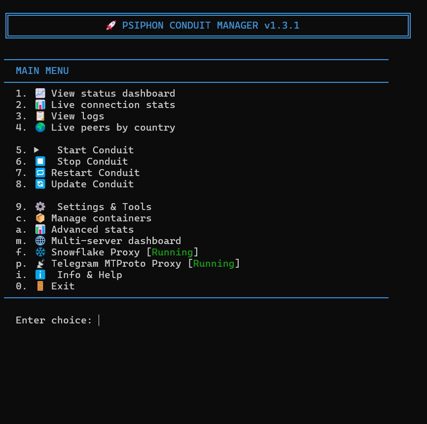
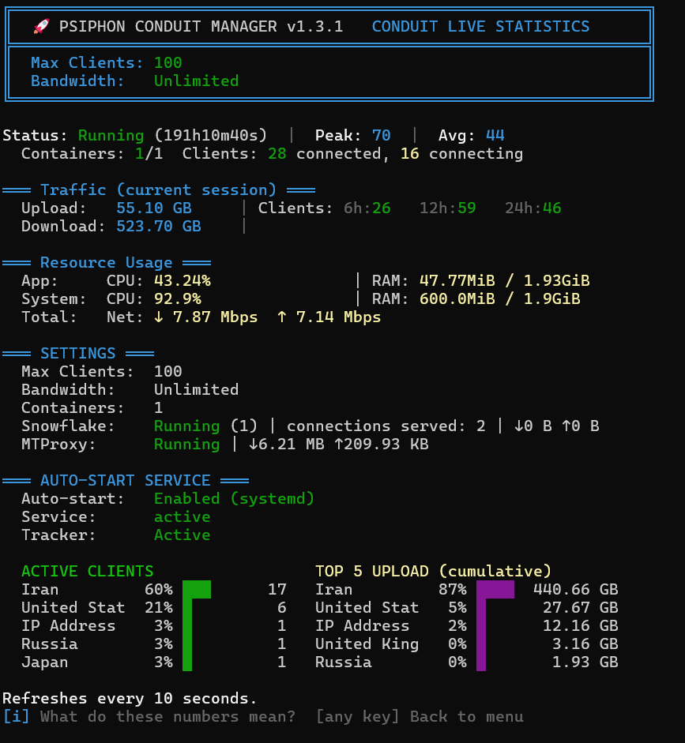

# Conduit Manager

```
  ██████╗ ██████╗ ███╗   ██╗██████╗ ██╗   ██╗██╗████████╗
 ██╔════╝██╔═══██╗████╗  ██║██╔══██╗██║   ██║██║╚══██╔══╝
 ██║     ██║   ██║██╔██╗ ██║██║  ██║██║   ██║██║   ██║
 ██║     ██║   ██║██║╚██╗██║██║  ██║██║   ██║██║   ██║
 ╚██████╗╚██████╔╝██║ ╚████║██████╔╝╚██████╔╝██║   ██║
  ╚═════╝ ╚═════╝ ╚═╝  ╚═══╝╚═════╝  ╚═════╝ ╚═╝   ╚═╝
                      M A N A G E R
```


A powerful management tool for deploying and managing Psiphon Conduit nodes on Linux servers. Help users access the open internet during network restrictions.

## Screenshots

| Main Menu | Live Dashboard |
|:-:|:-:|
|  |  |

| Live Map | Advanced Stats |
|:-:|:-:|
|  |  |

## Quick Install

```bash
curl -sL https://raw.githubusercontent.com/SamNet-dev/conduit-manager/main/conduit.sh | sudo bash
```

Or download and run manually:

```bash
wget https://raw.githubusercontent.com/SamNet-dev/conduit-manager/main/conduit.sh
sudo bash conduit.sh
```

## What's New in v1.3.1

- **Telegram MTProto Proxy** — Built-in MTProto proxy (mtg v2) with fake-TLS, share link & QR code, send to Telegram bot, resource configuration, and traffic monitoring
- **Auto-Update Checker** — Background version check with update badge on menu, optional automatic updates every 48h via cron
- **Multi-Server Dashboard Pagination** — Dashboard now supports 30 servers with page navigation (`[`/`]` keys), up from 9
- **Remote Server Deployment** — Install and configure Conduit on remote servers directly from the dashboard
- **MTProto in Status** — MTProxy status and traffic shown in the main live dashboard when enabled
- **Update Concurrency Guard** — Prevents simultaneous manual + cron updates with flock advisory locking

### v1.3

- **Snowflake Proxy Integration** — Built-in Tor Snowflake proxy with dual-instance support, resource configuration, and traffic monitoring
- **Multi-Server Dashboard** — Manage up to 30 remote servers from one TUI with live status, bulk actions, and per-server controls
- **Remote Server Management** — Add, edit, and remove servers with SSH key or password authentication
- **Encrypted Credential Storage** — AES-256-CBC encrypted password storage with automatic sshpass management
- **Non-Root SSH Support** — Automatic sudo prefix for non-root remote users with passwordless sudo verification
- **Telegram Bot Enhancements** — Inline keyboards, QR code delivery, system CPU/temp/RAM in reports, new commands (`/restart_all`, `/start_all`, `/stop_all`, `/settings`, `/update`, `/health`, `/logs_N`, `/qr`)
- **Dashboard Improvements** — Cleaner local section, upload/download columns, combined CPU(temp) display, fixed border alignment
- **Info & Help Pages** — New Snowflake Proxy explainer and Safety & Legal information pages
- **GeoIP Management** — Manual GeoIP database updates via CLI
- **New CLI Commands** — `conduit dashboard`, `conduit add-server`, `conduit remove-server`, `conduit servers`, `conduit snowflake`, `conduit update-geoip`
- **System Metrics in Reports** — CPU usage, temperature, and RAM in status JSON and Telegram notifications

## Features

- **One-Click Deployment** — Automatically installs Docker and configures everything
- **Scalable Containers** — Run unlimited containers based on your server's capacity
- **Multi-Distro Support** — Works on Ubuntu, Debian, CentOS, Fedora, Arch, Alpine, openSUSE
- **Auto-Start on Boot** — Supports systemd, OpenRC, and SysVinit
- **Snowflake Proxy** — Built-in Tor Snowflake proxy with dual-instance support and resource management
- **MTProto Proxy** — Telegram MTProto proxy (mtg v2) with fake-TLS, share link, QR code, and Telegram delivery
- **Auto-Update** — Background version check with update badge, optional automatic updates every 48h via cron
- **Multi-Server Dashboard** — Manage up to 30 remote servers from one TUI with live refresh, pagination, and bulk actions
- **Remote Server Management** — SSH key and encrypted password authentication with ControlMaster persistent connections
- **Live Dashboard** — Real-time stats with peak, average, CPU/RAM, temperature, and per-country breakdown
- **Connection History** — Track client counts over time with 6h, 12h, 24h snapshots
- **Advanced Stats** — Top countries by connected peers, download, upload, and unique IPs with bar charts
- **Live Peer Traffic** — Real-time traffic table by country with speed, total bytes, and IP/client counts
- **Background Tracker** — 24/7 traffic and connection monitoring via systemd service with GeoIP resolution
- **Telegram Bot** — On-demand `/status`, `/peers`, `/uptime`, `/containers` and remote container management via Telegram with inline keyboards and QR delivery
- **Per-Container Settings** — Configure max-clients, bandwidth, CPU, and memory per container
- **Resource Limits** — Set CPU and memory limits with smart defaults based on system specs
- **Easy Management** — Powerful CLI commands or interactive menu
- **Backup & Restore** — Backup and restore your node identity keys
- **Health Checks** — Comprehensive diagnostics for troubleshooting
- **Info & Help** — Built-in guides covering traffic, stats, Snowflake proxy, and safety & legal information
- **Safety & Legal Info** — Built-in pages explaining the legal protections and safety of running a node
- **Complete Uninstall** — Clean removal of all components including Telegram service

## Supported Distributions

| Family | Distributions |
|--------|---------------|
| Debian | Ubuntu, Debian, Linux Mint, Pop!_OS, Kali, Raspbian |
| RHEL | CentOS, Fedora, Rocky Linux, AlmaLinux, Amazon Linux |
| Arch | Arch Linux, Manjaro, EndeavourOS |
| SUSE | openSUSE Leap, openSUSE Tumbleweed |
| Alpine | Alpine Linux |

## macOS Support

Looking for macOS? We have a **macOS (Apple Silicon)** version available!

> **[macos-edition branch](https://github.com/SamNet-dev/conduit-manager/tree/macos-edition)** — Based on v1.0.2, developed by [@PouriaCh](https://github.com/PouriaCh)

Note: The Linux version (this branch) has the latest features including Telegram bot, multi-container scaling, per-container resource limits, and live dashboard. The macOS edition provides core functionality for Apple Silicon Macs.

## CLI Reference

After installation, use the `conduit` command:

### Status & Monitoring
```bash
conduit status       # Show current status and resource usage
conduit stats        # View live statistics (real-time dashboard)
conduit logs         # View raw Docker logs
conduit health       # Run health check diagnostics
conduit peers        # Live peer traffic by country (GeoIP)
```

### Rewards
```bash
conduit qr           # Show QR code to claim rewards via Ryve app
```

### Container Management
```bash
conduit start        # Start all Conduit containers
conduit stop         # Stop all Conduit containers
conduit restart      # Restart all Conduit containers
conduit update       # Update script + Docker images (with auto-update toggle)
conduit mtproto      # Manage MTProto proxy (status|start|stop|restart|remove)
```

### Configuration
```bash
conduit settings     # Change max-clients, bandwidth, CPU, memory per container
conduit menu         # Open interactive management menu
```

### Backup & Restore
```bash
conduit backup       # Backup your node identity keys
conduit restore      # Restore node identity from backup
```

### Maintenance
```bash
conduit uninstall    # Remove all components
conduit version      # Show version information
conduit help         # Show help message
```

## Interactive Menu

The interactive menu (`conduit menu`) provides access to all features:

| Option | Description |
|--------|-------------|
| **1** | View status dashboard — real-time stats with peak, average, 6h/12h/24h history, active clients |
| **2** | Live connection stats — streaming stats from Docker logs |
| **3** | View logs — raw Docker log output |
| **4** | Live peers by country — per-country traffic table with speed and client counts |
| **5** | Start Conduit |
| **6** | Stop Conduit |
| **7** | Restart Conduit |
| **8** | Update Conduit — script + Docker images, auto-update toggle |
| **9** | Settings & Tools — resource limits, QR code, backup, restore, health check, Telegram, uninstall |
| **c** | Manage containers — add or remove containers (up to 5) |
| **s** | Snowflake proxy — status, start/stop, resource configuration |
| **p** | Telegram MTProto Proxy — setup, share link & QR, send to Telegram, resource config |
| **a** | Advanced stats — top 5 charts for peers, download, upload, unique IPs |
| **i** | Info & Help — multi-page guide explaining traffic, network, stats, peak/avg/history |
| **0** | Exit |

## Configuration Options

| Option | Default | Range | Description |
|--------|---------|-------|-------------|
| `max-clients` | 200 | 1–1000 | Maximum concurrent proxy clients per container |
| `bandwidth` | 5 | 1–40, -1 | Bandwidth limit per peer (Mbps). Use -1 for unlimited. |
| `cpu` | Unlimited | 0.1–N cores | CPU limit per container (e.g. 1.0 = one core) |
| `memory` | Unlimited | 64m–system RAM | Memory limit per container (e.g. 256m, 1g) |

**Recommended values based on CPU:**

| CPU Cores | Recommended Containers | Max Clients (per container) |
|-----------|------------------------|-----------------------------|
| 1 Core | 1 | 100 |
| 2 Cores | 1–2 | 200 |
| 4 Cores | 2–4 | 400 |
| 8+ Cores | 4+ | 800 |

> **RAM:** Minimum 512MB. For 3+ containers, 4GB+ recommended.

## Installation Options

```bash
# Standard install
sudo bash conduit.sh

# Force reinstall
sudo bash conduit.sh --reinstall

# Uninstall everything
sudo bash conduit.sh --uninstall

# Show help
sudo bash conduit.sh --help
```

## Upgrading

Just run the install command above or use `conduit update` from the menu. Existing containers are recognized automatically. Telegram settings and node identity keys are preserved across upgrades.

## Requirements

- Linux server (any supported distribution)
- Root/sudo access
- Internet connection
- Minimum 512MB RAM (1GB+ recommended for multi-container)

## How It Works

1. **Detection** — Identifies your Linux distribution and init system
2. **Docker Setup** — Installs Docker if not present
3. **Hardware Check** — Detects CPU/RAM and recommends container count
4. **Container Deployment** — Pulls and runs the official Psiphon Conduit image
5. **Auto-Start Configuration** — Sets up systemd/OpenRC/SysVinit service
6. **Tracker Service** — Starts background traffic tracker with GeoIP resolution
7. **CLI Installation** — Creates the `conduit` management command

## Claim Rewards (OAT Tokens)

Conduit node operators can earn OAT tokens for contributing to the Psiphon network. To claim rewards:

1. **Install the Ryve app** on your phone
2. **Create a crypto wallet** within the app
3. **Link your Conduit containers** by scanning the QR code:
   - From the menu: Select Settings & Tools **Option 6 → Show QR Code & Conduit ID**
   - From Manage Containers: press **[q]** to display QR code
   - CLI: `conduit qr`
4. **Scan the QR code** with the Ryve app to link your node
5. **Monitor & earn** — the app shows your last 48 hours of connection activity and OAT token rewards

> Each container has its own unique Conduit ID and QR code. If running multiple containers, you'll need to link each one separately.

## Security

- **Secure Backups**: Node identity keys are stored with restricted permissions (600)
- **No Telemetry**: The manager collects no data and sends nothing externally
- **Local Tracking Only**: Traffic stats are stored locally and never transmitted
- **Telegram Optional**: Bot notifications are opt-in only, zero resources used if disabled

---

<div dir="rtl">

# راهنمای فارسی - مدیریت کاندوییت

ابزار قدرتمند برای راه‌اندازی و مدیریت نود سایفون کاندوییت روی سرورهای لینوکس. به کاربران کمک کنید تا در زمان محدودیت‌های اینترنتی به اینترنت آزاد دسترسی داشته باشند.

## تصاویر

| منوی اصلی | داشبورد زنده |
|:-:|:-:|
|  |  |

| نقشه زنده | آمار پیشرفته |
|:-:|:-:|
|  |  |

## نصب سریع

دستور زیر را در ترمینال سرور اجرا کنید:

```bash
curl -sL https://raw.githubusercontent.com/SamNet-dev/conduit-manager/main/conduit.sh | sudo bash
```

یا دانلود و اجرای دستی:

```bash
wget https://raw.githubusercontent.com/SamNet-dev/conduit-manager/main/conduit.sh
sudo bash conduit.sh
```

## تازه‌های نسخه 1.3.1

- **پروکسی MTProto تلگرام** — پروکسی MTProto (mtg v2) با fake-TLS، لینک اشتراک‌گذاری و QR کد، ارسال به ربات تلگرام، پیکربندی منابع و مانیتورینگ ترافیک
- **بررسی خودکار به‌روزرسانی** — بررسی نسخه در پس‌زمینه با نشان به‌روزرسانی در منو، به‌روزرسانی خودکار اختیاری هر ۴۸ ساعت
- **صفحه‌بندی داشبورد** — داشبورد چند سرور حالا تا ۳۰ سرور با ناوبری صفحه پشتیبانی می‌کند
- **نصب ریموت** — نصب و پیکربندی کاندوییت روی سرورهای ریموت مستقیماً از داشبورد
- **MTProto در وضعیت** — نمایش وضعیت و ترافیک MTProxy در داشبورد اصلی

### نسخه 1.3

- **پروکسی اسنوفلیک** — پروکسی Snowflake تور با پشتیبانی دو نمونه، پیکربندی منابع و مانیتورینگ ترافیک
- **داشبورد چند سرور** — مدیریت تا ۳۰ سرور ریموت از یک صفحه با وضعیت زنده، عملیات گروهی و کنترل هر سرور
- **مدیریت سرور ریموت** — اضافه، ویرایش و حذف سرور با احراز هویت کلید SSH یا رمز عبور
- **ذخیره رمزنگاری‌شده اعتبارنامه** — رمزنگاری AES-256-CBC برای رمز عبور با مدیریت خودکار sshpass
- **پشتیبانی SSH غیر root** — افزودن خودکار sudo برای کاربران غیر root با تأیید sudo بدون رمز
- **بهبود ربات تلگرام** — دکمه‌های اینلاین، ارسال QR کد، CPU/دما/RAM سیستم در گزارش‌ها، دستورات جدید (`/restart_all`، `/start_all`، `/stop_all`، `/settings`، `/update`، `/health`، `/logs_N`، `/qr`)
- **بهبود داشبورد** — بخش محلی تمیزتر، ستون‌های آپلود/دانلود، نمایش ترکیبی CPU(دما)، اصلاح حاشیه‌ها
- **صفحات اطلاعات جدید** — صفحه توضیح پروکسی اسنوفلیک و اطلاعات ایمنی و حقوقی
- **مدیریت GeoIP** — به‌روزرسانی دستی پایگاه داده GeoIP از CLI
- **دستورات جدید CLI** — `conduit dashboard`، `conduit add-server`، `conduit remove-server`، `conduit servers`، `conduit snowflake`، `conduit update-geoip`
- **معیارهای سیستم در گزارش‌ها** — مصرف CPU، دما و RAM در JSON وضعیت و اعلان‌های تلگرام

## ویژگی‌ها

- **نصب با یک کلیک** — داکر و تمام موارد مورد نیاز به صورت خودکار نصب می‌شود
- **مقیاس‌پذیری نامحدود** — اجرای کانتینرهای نامحدود بر اساس ظرفیت سرور
- **پشتیبانی از توزیع‌های مختلف** — اوبونتو، دبیان، سنت‌اواس، فدورا، آرچ، آلپاین، اوپن‌سوزه
- **راه‌اندازی خودکار** — پس از ریستارت سرور، سرویس به صورت خودکار اجرا می‌شود
- **پروکسی اسنوفلیک** — پروکسی Snowflake تور با پشتیبانی دو نمونه و مدیریت منابع
- **پروکسی MTProto** — پروکسی MTProto تلگرام (mtg v2) با fake-TLS، لینک اشتراک‌گذاری، QR کد و ارسال به تلگرام
- **به‌روزرسانی خودکار** — بررسی نسخه در پس‌زمینه با نشان به‌روزرسانی، به‌روزرسانی خودکار اختیاری هر ۴۸ ساعت
- **داشبورد چند سرور** — مدیریت تا ۳۰ سرور ریموت با رفرش زنده، صفحه‌بندی و عملیات گروهی
- **مدیریت سرور ریموت** — احراز هویت کلید SSH و رمز عبور رمزنگاری‌شده با اتصال پایدار ControlMaster
- **داشبورد زنده** — نمایش لحظه‌ای پیک، میانگین، CPU، RAM، دما و تفکیک کشوری
- **تاریخچه اتصال** — ردیابی تعداد کلاینت‌ها با اسنپ‌شات ۶، ۱۲ و ۲۴ ساعته
- **آمار پیشرفته** — نمودار میله‌ای برترین کشورها بر اساس اتصال، دانلود، آپلود و IP
- **مانیتورینگ ترافیک** — جدول لحظه‌ای ترافیک بر اساس کشور با سرعت و تعداد کلاینت
- **ردیاب پس‌زمینه** — سرویس ردیابی ۲۴/۷ ترافیک و اتصالات با تشخیص جغرافیایی
- **ربات تلگرام** — دستورات `/status`، `/peers`، `/uptime`، `/containers` و مدیریت کانتینر از راه دور با دکمه‌های اینلاین و ارسال QR کد
- **تنظیمات هر کانتینر** — پیکربندی حداکثر کاربران، پهنای باند، CPU و حافظه برای هر کانتینر
- **محدودیت منابع** — تنظیم محدودیت CPU و حافظه با پیش‌فرض‌های هوشمند
- **مدیریت آسان** — دستورات قدرتمند CLI یا منوی تعاملی
- **پشتیبان‌گیری و بازیابی** — پشتیبان‌گیری و بازیابی کلیدهای هویت نود
- **بررسی سلامت** — تشخیص جامع برای عیب‌یابی
- **راهنما و اطلاعات** — راهنمای چندصفحه‌ای شامل ترافیک، آمار، پروکسی اسنوفلیک و اطلاعات ایمنی و حقوقی
- **اطلاعات ایمنی و حقوقی** — صفحات توضیح حفاظت قانونی و ایمنی اجرای نود
- **حذف کامل** — پاکسازی تمام فایل‌ها و تنظیمات شامل سرویس تلگرام

## پشتیبانی از macOS

به دنبال نسخه macOS هستید؟ نسخه **macOS (Apple Silicon)** موجود است!

> **[شاخه macos-edition](https://github.com/SamNet-dev/conduit-manager/tree/macos-edition)** — بر اساس نسخه 1.0.2، توسعه داده شده توسط [@PouriaCh](https://github.com/PouriaCh)

توجه: نسخه لینوکس (این شاخه) شامل جدیدترین امکانات مانند ربات تلگرام، مقیاس‌پذیری چند کانتینره، محدودیت منابع و داشبورد زنده است. نسخه macOS عملکرد اصلی را برای مک‌های Apple Silicon فراهم می‌کند.

## دستورات CLI

### وضعیت و مانیتورینگ
```bash
conduit status       # نمایش وضعیت و مصرف منابع
conduit stats        # داشبورد زنده (لحظه‌ای)
conduit logs         # لاگ‌های داکر
conduit health       # بررسی سلامت سیستم
conduit peers        # ترافیک بر اساس کشور (GeoIP)
```

### پاداش
```bash
conduit qr           # نمایش QR کد برای دریافت پاداش از اپلیکیشن Ryve
```

### مدیریت کانتینر
```bash
conduit start        # شروع تمام کانتینرها
conduit stop         # توقف تمام کانتینرها
conduit restart      # ریستارت تمام کانتینرها
conduit update       # به‌روزرسانی اسکریپت + ایمیج‌های داکر (با تنظیم به‌روزرسانی خودکار)
conduit mtproto      # مدیریت پروکسی MTProto (وضعیت|شروع|توقف|ریستارت|حذف)
```

### پیکربندی
```bash
conduit settings     # تغییر تنظیمات هر کانتینر
conduit menu         # منوی تعاملی
```

### پشتیبان‌گیری و بازیابی
```bash
conduit backup       # پشتیبان‌گیری از کلیدهای نود
conduit restore      # بازیابی کلیدهای نود از پشتیبان
```

### نگهداری
```bash
conduit uninstall    # حذف کامل
conduit version      # نمایش نسخه
conduit help         # راهنما
```

## منوی تعاملی

| گزینه | توضیحات |
|-------|---------|
| **1** | داشبورد وضعیت — آمار لحظه‌ای با پیک، میانگین، تاریخچه ۶/۱۲/۲۴ ساعته |
| **2** | آمار زنده اتصال — استریم آمار از لاگ داکر |
| **3** | مشاهده لاگ — خروجی لاگ داکر |
| **4** | ترافیک زنده به تفکیک کشور — جدول ترافیک با سرعت و تعداد کلاینت |
| **5** | شروع کاندوییت |
| **6** | توقف کاندوییت |
| **7** | ریستارت کاندوییت |
| **8** | به‌روزرسانی — اسکریپت + ایمیج‌های داکر، تنظیم به‌روزرسانی خودکار |
| **9** | تنظیمات و ابزارها — محدودیت منابع، QR کد، پشتیبان‌گیری، بازیابی، تلگرام، حذف نصب |
| **c** | مدیریت کانتینرها — اضافه یا حذف (تا ۵) |
| **s** | پروکسی اسنوفلیک — وضعیت، شروع/توقف، پیکربندی منابع |
| **p** | پروکسی MTProto تلگرام — راه‌اندازی، اشتراک لینک و QR، ارسال به تلگرام |
| **a** | آمار پیشرفته — نمودار برترین کشورها |
| **i** | راهنما — توضیحات ترافیک، شبکه، آمار، پیک/میانگین/تاریخچه |
| **0** | خروج |

## تنظیمات

| گزینه | پیش‌فرض | محدوده | توضیحات |
|-------|---------|--------|---------|
| `max-clients` | 200 | ۱–۱۰۰۰ | حداکثر کاربران همزمان برای هر کانتینر |
| `bandwidth` | 5 | ۱–۴۰ یا ۱- | محدودیت پهنای باند (Mbps). برای نامحدود ۱- وارد کنید. |
| `cpu` | نامحدود | 0.1–N هسته | محدودیت CPU هر کانتینر (مثلاً 1.0 = یک هسته) |
| `memory` | نامحدود | 64m–حافظه سیستم | محدودیت حافظه هر کانتینر (مثلاً 256m، 1g) |

**مقادیر پیشنهادی بر اساس CPU:**

| پردازنده | کانتینر پیشنهادی | حداکثر کاربران (هر کانتینر) |
|----------|-------------------|----------------------------|
| ۱ هسته | ۱ | ۱۰۰ |
| ۲ هسته | ۱–۲ | ۲۰۰ |
| ۴ هسته | ۲–۴ | ۴۰۰ |
| ۸+ هسته | ۴+ | ۸۰۰ |

> **رم:** حداقل ۵۱۲ مگابایت. برای ۳+ کانتینر، ۴ گیگابایت+ پیشنهاد می‌شود.

## گزینه‌های نصب

```bash
# نصب استاندارد
sudo bash conduit.sh

# نصب مجدد اجباری
sudo bash conduit.sh --reinstall

# حذف کامل
sudo bash conduit.sh --uninstall

# نمایش راهنما
sudo bash conduit.sh --help
```

## ارتقا از نسخه‌های قبلی

فقط دستور نصب بالا را اجرا کنید یا از منو گزینه `conduit update` را بزنید. کانتینرهای موجود به صورت خودکار شناسایی می‌شوند. تنظیمات تلگرام و کلیدهای هویت نود در به‌روزرسانی حفظ می‌شوند.

## پیش‌نیازها

- سرور لینوکس
- دسترسی root یا sudo
- اتصال اینترنت
- حداقل ۵۱۲ مگابایت رم (۱ گیگ+ برای چند کانتینر پیشنهاد می‌شود)

## نحوه عملکرد

1. **تشخیص** — شناسایی توزیع لینوکس و سیستم init
2. **نصب داکر** — در صورت نبود، داکر نصب می‌شود
3. **بررسی سخت‌افزار** — تشخیص CPU و RAM و پیشنهاد تعداد کانتینر
4. **راه‌اندازی کانتینر** — دانلود و اجرای ایمیج رسمی سایفون
5. **پیکربندی سرویس** — تنظیم سرویس خودکار (systemd/OpenRC/SysVinit)
6. **سرویس ردیاب** — شروع ردیاب ترافیک پس‌زمینه
7. **نصب CLI** — ایجاد دستور مدیریت `conduit`

## دریافت پاداش (توکن OAT)

اپراتورهای نود کاندوییت می‌توانند با مشارکت در شبکه سایفون توکن OAT کسب کنند. مراحل دریافت پاداش:

1. **اپلیکیشن Ryve** را روی گوشی نصب کنید
2. **یک کیف پول کریپتو** در اپلیکیشن بسازید
3. **کانتینرهای خود را لینک کنید** با اسکن QR کد:
   - از منو تنظیمات: **گزینه ۶ ← نمایش QR کد و شناسه کاندوییت**
   - از مدیریت کانتینرها: کلید **[q]** را بزنید
   - CLI: `conduit qr`
4. **QR کد را اسکن کنید** با اپلیکیشن Ryve تا نود شما لینک شود
5. **مانیتور و کسب درآمد** — اپلیکیشن فعالیت ۴۸ ساعت اخیر و توکن‌های OAT را نمایش می‌دهد

> هر کانتینر شناسه و QR کد منحصر به فرد خود را دارد. اگر چند کانتینر اجرا می‌کنید، باید هر کدام را جداگانه لینک کنید.

## امنیت

- **پشتیبان‌گیری امن**: کلیدهای هویت نود با دسترسی محدود (600) ذخیره می‌شوند
- **بدون تلمتری**: هیچ داده‌ای جمع‌آوری یا ارسال نمی‌شود
- **ردیابی محلی**: آمار ترافیک فقط به صورت محلی ذخیره شده و هرگز ارسال نمی‌شود
- **تلگرام اختیاری**: اعلان‌های ربات کاملاً اختیاری هستند و در صورت غیرفعال بودن هیچ منبعی مصرف نمی‌شود

</div>

---

## License

MIT License

## Contributing

Pull requests welcome. For major changes, open an issue first.

## Links

- [Psiphon](https://psiphon.ca/)
- [Psiphon Conduit](https://github.com/Psiphon-Inc/conduit)
